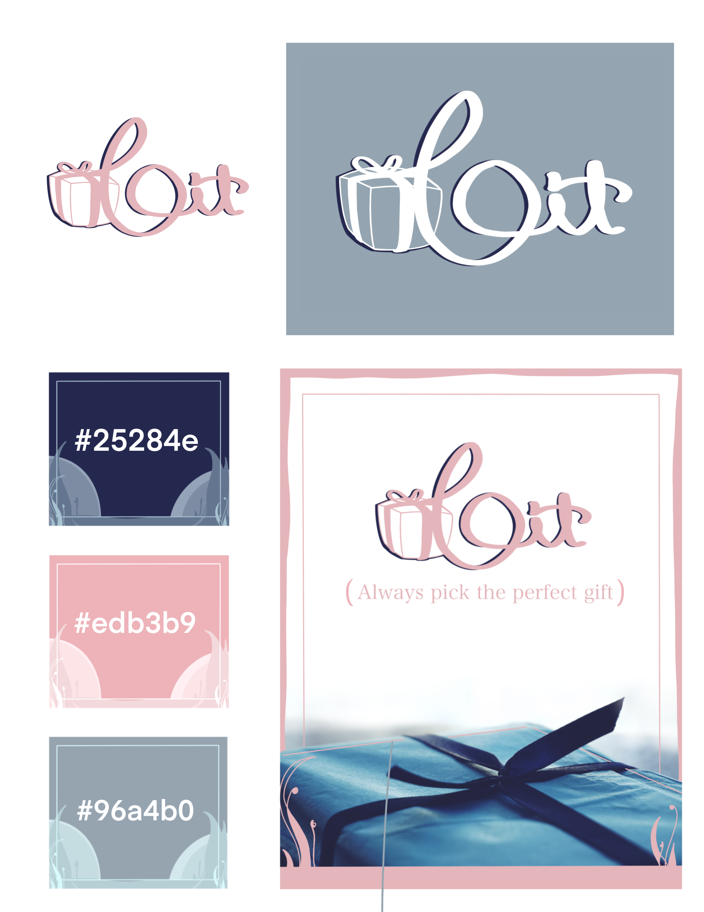

# gitwrap

Gitwrap is a gift guide application for choosing your next great gift. Looking for a way to show somone special that you care, but you're not sure where to start? The Gitwrap app begins with a number of category and price range options to browse. You can choose from ctegories such as 'tech', 'music', 'movies', etc... Choose a gift from the list to read more details and find a purchase link. Did you find an idea that you like, but not quite ready to buy? You can add your gift to a personal favorites list. This will allow you to save your gift ideas for another time. This application will make sure you never get stuck without the perfect gift idea again.

## Features

As a user I want to be able to go to the landing page which displays categories
As a user, I want to be able to navigate to my wishlist/favorite list from the landing page
As a user, I wish to click into a category to display its categories’ contents
As a user, Click on item to see name, description, price, and purchase link
As a user I want to be able to transfer an item into our favorite list/wishlist
As a user, i want to be able to create gifts inside of a category that I am looking through
As a user, I want to be able to read my wishlist and see the displayed item
As a user, I want to be able to update my wishlist with the picked item in a category
As a user, I want to be able to delete an item in a wishlist that I choose to delete

## Technologies Used

Frontend:

- HTML
- CSS
- SCSS
- React.js
- React Bootstrap
- Axios
- Express

Backend API:
( https://gitwrap-backend.herokuapp.com/gifts )

## Getting Started/Installation Instructions

Link to deployed app on Heroku: http://git-wrap.herokuapp.com/

OR

Clone this project from the GitHub repo
Run 'npm install' to install dependencies
Open in your preferred text editor
Run 'npm start' to begin your local server and run the application

## Contribution Guidelines

We, the Anonymous Animals team, welcome any feedback on this application. If you would like to contribute, please fork/clone this repo, make you changes, and submit a pull request.

https://github.com/anonymous-animals/gitwrap-frontend
